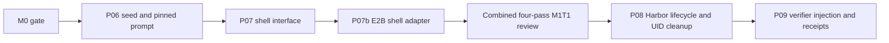
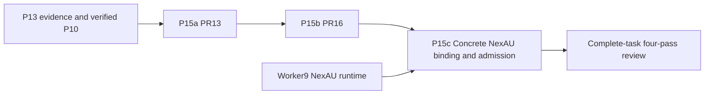

# Delivery plan: M1 T1 baseline task

This published slice records the baseline task's bounded PRs and dependency order.
These labels are task IDs, not GitHub PR numbers. The approved E2B migration
is stacked as PR11 (shell) → PR12 (controller dependencies) → PR15 (NexAU loop).

| Task | Slice | Deliverable | Depends on | PR |
| --- | --- | --- | --- | --- |
| M1 T1 | S1 / P06 | Pinned AHE assets and immutable baseline/prompt identity | M0 gate | [#7](https://github.com/divo12/Syndicate/pull/7) |
| M1 T1 | S2 / P07 | Typed sandbox shell interface and seed-visible formatting | P06 | [#8](https://github.com/divo12/Syndicate/pull/8) |
| M1 T1 | S3 / P07b | Controller-side E2B shell and transient capture | P07 | [#11](https://github.com/divo12/Syndicate/pull/11) |

P07b owns `src/syndicate/adapters/e2b_shell.py` and its tests/docs. It creates
no durable raw-trace files or local observability fallback. The Harbor adapter
owns dedicated-UID whole-trial stop confirmation, including escaped descendants,
before verification. Review the complete PR7/8/11 task at exact heads; any
update requires the affected passes to be refreshed. Milestone integration and
merge authorization are separate.

## M2 T2 task-judge stack

Status: restacked onto `origin/main` `bee48c46`, which includes merged
[P14 #9](https://github.com/divo12/Syndicate/pull/9),
[P12 #10](https://github.com/divo12/Syndicate/pull/10), and the layered backend
refactor. Product roles stay on fixed `gpt-5.4-mini`. Neatlogs is the only
durable trajectory source; there is no local trace store or fallback.

| Slice | Bounded deliverable | GitHub | Head | Depends on |
| --- | --- | --- | --- | --- |
| P15a | Typed report, recovery and citation validation | [#13](https://github.com/divo12/Syndicate/pull/13) | `9d02603` | main / P14 / P12 |
| P15b | Dispatch/failure boundary and ID/offset read ledger | [#16](https://github.com/divo12/Syndicate/pull/16) | `4a9e50e` | P15a |
| P15c | Concrete NexAU binding and semantic admission | pending | — | P15b, verified P10, worker9 runtime |

Layered ownership after the backend refactor:

- `src/syndicate/models/judging.py`: public rubric contracts plus P15a report
  types (`ReportDraft`, `TaskReport`, `Finding`, `RunCoverage`) and P15b
  `JudgeAttempt` / `SpanReadPage`.
- `src/syndicate/services/judging.py`: `JudgeRegistry`, `validate_report`,
  `execute_judge`, and `JudgeEvidence`.
- `src/syndicate/models/evidence.py` and `src/syndicate/services/evidence.py`:
  citation grants and `ExpectedTrace` / `fetch` readback. Do not reintroduce
  flat `judge_contracts.py`, `judging.py`, `evidence.py`, or `budget_policy.py`.

P15a requires every assigned run to be accounted and every cited ID to have
been examined against complete authorized remote evidence. P15b fails closed
on missing capture or verifier references and records only IDs and page
offsets. P15c remains the concrete NexAU binding and known-outcome admission
slice; it needs actual runtime behavior tests, not stubs.

Passing synthetic tests is preparation evidence, not live acceptance. After
all three slices are integrated, review the complete M2 T2 stack in the four
ordered passes before the M2 live gate. Merge still requires explicit user
instruction. Each implementation PR must stay under 500 changed lines versus
its actual base, including tests and docs.
