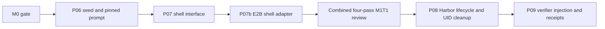

# Delivery plan: M1 T1 baseline task

This published slice records the baseline task's bounded PRs and dependency order.
These labels are task IDs, not GitHub PR numbers. The approved E2B migration
is stacked as PR11 (shell) → PR12 (controller dependencies) → PR15 (NexAU loop).

| Task | Slice | Deliverable | Depends on | PR |
| --- | --- | --- | --- | --- |
| M1 T1 | S1 / P06 | Pinned AHE assets and immutable baseline/prompt identity | M0 gate | [#7](https://github.com/divo12/Syndicate/pull/7) |
| M1 T1 | S2 / P07 | Typed sandbox shell interface and seed-visible formatting | P06 | [#8](https://github.com/divo12/Syndicate/pull/8) |
| M1 T1 | S3 / P07b | Controller-side E2B shell and transient capture | P07 | [#11](https://github.com/divo12/Syndicate/pull/11) |

P07b owns `shell_backend.py` and its tests/docs. It creates no durable raw-trace
files or local observability fallback. The Harbor adapter owns dedicated-UID
whole-trial stop confirmation, including escaped descendants, before verification.
Review the complete PR7/8/11 task at exact heads; any update requires the affected
passes to be refreshed. Milestone integration and merge authorization are separate.
