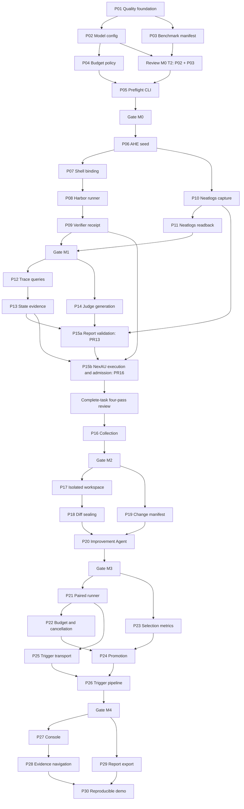
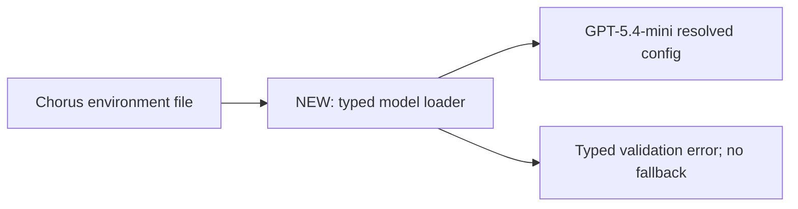

# Syndicate delivery DAG

Status: fresh scheduling plan, 6 September 2026. Earlier implementation workspaces are preserved for reference only; none is an accepted deliverable. `spec.md` is the orchestrator-owned requirements authority.

## Delivery rules

- A milestone M0–M5 contains logical tasks T1…Tn. Each task contains PR-sized subtasks S1…Sn.
- Every PR must have **additions + deletions < 500**, relative to its actual PR base. Count tests, docs and generated files too. Do not minify, omit tests or hide lockfiles to game the cap. Aim for 250–400 lines; split a coherent subtask further before it reaches the cap.
- Every implementation subtask is TDD: red evidence, minimal code, green evidence. Use typed classes/objects, enums/value types, no Any/getattr/setattr/dict domain models, clean Python and Ponytail.
- Use Radon CC <= 10, strict typing and focused tests. Review module responsibility as well as function complexity; no god files.
- Implementation sessions: GPT-6 Astra low or GPT-5.6 Terra high. Review sessions: GPT-5.6 Luna high. Product roles: GPT-5.4-mini fixed for the campaign.
- Workers own implementation, commits, pushes, PR creation, conflict resolution and restacking. Orchestrator owns spec, DAG, assignments, monitoring and routing review/CI findings.
- Open a draft PR as soon as a bounded slice is green and reviewable; do not wait for the milestone. Include parent/dependency PRs and exact line count.
- Review each **logical task's combined PR set** at pinned heads in four ordered passes: spec/design; Python/types/TDD; Ponytail; complexity/module responsibility. Route each finding to its owning PR. Fixes invalidate affected reviews; recheck the updated combined task snapshot.
- Run 2–3 real integration rounds at the milestone gate, proportionate to that milestone. M0 verifies actual configuration/benchmark inputs and preflight; M1 verifies actual runner/environment; M4 verifies the real learning/A-B loop. Never label an offline fixture test as a live model/service run.
- Merge requires explicit user instruction. Ready task stacks can be bases for the next task without merging into main. Recheck PR sizes and task integration after restacking.
- Preserve old broad work as reference. Reuse only bounded reviewed behavior with TDD evidence; do not cherry-pick a monolithic implementation.

## Task and PR catalog

Dependencies below are semantic dependencies. `R(task)` is that task's four-review gate. `G(Mn)` is all task reviews plus the milestone's real integration gate.

| Milestone/task | PR subtask | Bounded deliverable | Depends on | Target changed LOC |
| --- | --- | --- | --- | --- |
| M0 T1 Foundation | S1 / P01 | Python project, compact dependency pins, quality commands and CI gates | none | 250–400 |
| M0 T2 Immutable inputs | S1 / P02 | GPT-5.4-mini typed provider/deployment config and secret-safe loader | P01 | 250–400 |
| M0 T2 Immutable inputs | S2 / P03 | Pinned benchmark manifest, protected split assignment and development-only task constraint | P01 | 250–400 |
| M0 T3 Preflight | S1 / P04 | Typed role/campaign budget policy and validation; no paid dispatch | P02 | 200–350 |
| M0 T3 Preflight | S2 / P05 | Typed preflight CLI composes config, manifest and budget checks | R(M0T2), P04 | 250–400 |
| M1 T1 Baseline | S1 / P06 | AHE seed assets, provenance and explicit compatibility manifest | G(M0) | 200–400 |
| M1 T1 Baseline | S2 / P07 | Sandbox shell binding with seed-visible behavior and bounded processes | P06 | 300–450 |
| M1 T2 Runner | S1 / P08 | Harbor/NexAU lifecycle adapter and protected task mount checks | R(M1T1) | 300–450 |
| M1 T2 Runner | S2 / P09 | Trusted verifier capture and typed run receipt; cleanup ordering | P08 | 250–400 |
| M1 T3 Evidence capture | S1 / P10 | Neatlogs-only raw/model-visible capture and remote span references | G(M0), P06 | 300–450 |
| M1 T3 Evidence capture | S2 / P11 | Neatlogs ingestion/readback and explicit incomplete-capture behavior | P10 | 300–450 |
| M2 T1 Evidence access | S1 / P12 | Manifest/search/paged span reads with coverage and permission checks | G(M1) | 300–450 |
| M2 T1 Evidence access | S2 / P13 | Run-aligned state/audit/verifier evidence interface | P12 | 250–400 |
| M2 T2 Task judges | S1 / P14 | Typed JudgeSpec and task-driven generation/validation | G(M1) | 250–400 |
| M2 T2 Task judges | S2a / P15a | Typed report, recovery and citation validation; [PR #13](https://github.com/divo12/Syndicate/pull/13) | P14, P13 evidence, verified P10 | 355 |
| M2 T2 Task judges | S2b / P15b | NexAU execution and semantic/known-outcome admission; [PR #16](https://github.com/divo12/Syndicate/pull/16) (execution boundary implemented; integration pending) | P15a, R(M2T1), verified P10, worker9 runtime | <500 |
| M2 T3 Collection | S1 / P16 | Complete task-report barrier, missing-report status and overview index | R(M2T2) | 250–400 |
| M3 T1 Candidate workspace | S1 / P17 | Immutable incumbent snapshot and isolated allowlisted candidate edits | G(M2) | 300–450 |
| M3 T1 Candidate workspace | S2 / P18 | Diff/protected-path validation and sealed candidate hash | P17 | 250–400 |
| M3 T2 Improvement Agent | S1 / P19 | Typed diagnosis/change manifest and scoped evidence tools | G(M2) | 250–400 |
| M3 T2 Improvement Agent | S2 / P20 | Model-backed proposal/patch execution and focused candidate checks | R(M3T1), P19 | 300–450 |
| M4 T1 Paired experiments | S1 / P21 | Typed pair schedule, equal controls and isolated arm execution | G(M3) | 300–450 |
| M4 T1 Paired experiments | S2 / P22 | Persisted role reservations, retry/repair accounting and cancellation | P21 | 300–450 |
| M4 T2 Selection | S1 / P23 | Typed metrics, task regression floors and inconclusive outcomes | G(M3) | 300–450 |
| M4 T2 Selection | S2 / P24 | Controller decision, atomic promotion and rollback lineage | R(M4T1), P23 | 250–400 |
| M4 T3 Orchestration | S1 / P25 | Trigger.dev typed local Python transport, strict receipts and process cancellation | G(M1), P21 | 300–450 |
| M4 T3 Orchestration | S2 / P26 | Trigger workflow composition for execute→judge→collect→improve→compare→select | R(M4T2), P25 | 250–400 |
| M5 T1 Review console | S1 / P27 | Read-only campaign/task views from actual receipts | G(M4) | 300–450 |
| M5 T1 Review console | S2 / P28 | Finding→evidence→diagnosis→diff→comparison navigation | P27 | 300–450 |
| M5 T2 Delivery | S1 / P29 | Markdown/JSON reports, held-out evaluation view and limitations | G(M4) | 250–400 |
| M5 T2 Delivery | S2 / P30 | Repeat/recovery scenarios and reproducible demo runbook | R(M5T1), P29 | 250–400 |

If a row exceeds its budget, add a named S3/S4 row and dependency before opening the next PR. Scope estimates do not waive the hard <500 gate.

## Milestone DAG

```mermaid
flowchart LR
  M0["M0: contracts and preflight"] --> G0["reviews + real preflight checks"]
  G0 --> M1["M1: baseline runner and traces"]
  M1 --> G1["reviews + real runner checks"]
  G1 --> M2["M2: task judges and collection"]
  M2 --> G2["reviews + real judge checks"]
  G2 --> M3["M3: Improvement Agent and isolated patch"]
  M3 --> G3["reviews + real candidate checks"]
  G3 --> M4["M4: A/B, promotion and Trigger workflows"]
  M4 --> G4["reviews + real A/B/recovery rounds"]
  G4 --> M5["M5: review console and demonstration"]
```



## Subtask DAG: where work can run in parallel



Intermediate review nodes are omitted from the large DAG for readability; the catalog dependencies and per-task gates remain mandatory. The five-hour execution window ends 2026-09-06 03:11:37 UTC. Prepare downstream tests/code in parallel against agreed interfaces while parent reviews finish; do not mark a dependent slice accepted until its prerequisites are integrated and reviewed. Reviewers run the four ordered passes continuously, with separate receipts, pausing only for findings or changed heads.

## M2 T2 task-judge integration status

P14 [PR #9](https://github.com/divo12/Syndicate/pull/9) provides schema/public-provenance validation and pinned specifications. Historical head `a7cdf16` is superseded by `37d70a5`; this is separate from P15 integration and does not establish semantic judge validity.

P15a [PR #13](https://github.com/divo12/Syndicate/pull/13) provides typed reports and authorized citation validation through worker7. P15b [PR #16](https://github.com/divo12/Syndicate/pull/16) has the single-attempt boundary, unchanged controller verifier/usage references and ID/offset read ledger. Concrete NexAU execution reuses worker9's runtime; worker7 owns evidence resolution, and worker11 owns verified remote readback. Do not duplicate those implementations.

Both P15 slices depend on P13 trusted verifier evidence, verified P10 Neatlogs readback and the worker9 runtime. Neatlogs is the only durable trajectory source; missing/incomplete remote evidence blocks judging, with no local storage or fallback. Passing synthetic tests (including the historical 118-test run) is preparation evidence, not live acceptance. Semantic/known-outcome admission remains pending real integration. After both slices are integrated, review the complete M2 T2 stack in the four ordered passes before the M2 live gate.

## Git stack and review mechanics

Semantic parallelism and PR base order are different. Independent authors work concurrently in isolated branches. Each task has a worker-owned integration tip assembling its PRs in deterministic order; PR bases point to the previous stack branch so each diff is incremental. The stack owner performs all restacking and verifies that the cumulative task tip passes tests.

A branch layout can be:

```text
main
 └─ stack/m0/p01-quality
     └─ stack/m0/p02-model
         └─ stack/m0/p03-benchmark
             └─ stack/m0/p04-budget
                 └─ stack/m0/p05-preflight
```

P02 and P03 can be authored in parallel against P01; their final Git order does not invent a semantic dependency. Never duplicate commits by both cherry-picking and merging the same slice. Record each PR URL, base/head SHA, task ID, owner, tests, four-review status and milestone gate in the delivery ledger.

## Every PR body

1. Milestone/task/subtask and problem→behavior change.
2. Base PR and dependency PR links.
3. A small Mermaid architecture diagram showing what this PR adds or changes.
4. Public interface and spec requirement IDs implemented.
5. TDD red/green evidence and current checks.
6. `additions + deletions` for this PR’s exact base.
7. Review gate status; distinguish draft from task-reviewed.
8. Real-test evidence or clearly stated milestone test pending.

Example PR diagram:



No merge or deployment is implied by opening a draft PR. The orchestrator reports reviewable stacks to the user as they become available.

## Current authorization and blockers

Implementation, commits, pushes and draft stacked PR creation are explicitly authorized. Earlier broad workers are stopped. Existing work is not discarded or automatically accepted.

M0 code and real local preflight checks can proceed. Paid model campaigns still need the requested ceiling. Trigger.dev project credentials and Neatlogs credential location remain pending; those block actual external integration evidence, not M0 implementation.

The full local spec and this DAG are review artifacts. If publishing either as repository changes would breach the limit, use separately scoped documentation PRs under the same <500 rule; do not bundle the large HTML or screenshots into implementation PRs.

## Neatlogs-only override

PR6/P10 must use Neatlogs as the sole durable trajectory store. No local raw/model-visible trace files, local outbox or fallback. Evidence consumers must use remote span references and queries. Missing capture blocks evaluation. Local control/config/diff/decision metadata may remain, without copied trace payloads.

## Active scope refinements (deadline execution)

- Planned subtask labels are not GitHub PR numbers. P10 capture is GitHub PR6; P06 seed is PR7; P07 shell interface is PR8; P14 JudgeSpec is PR9; P12 query preparation is PR10.
- M1T1 adds P07b concrete container shell backend (GitHub PR11) to keep each PR below500 lines. Final task review includes P06/P07/P07b together.
- M1T2 splits P08 into P08a runtime installation/identity (PR12), P08b NexAU bridge/typed limits, P08c Harbor lifecycle/cleanup, then P09 verifier receipts. Final task gate reviews the combined set, not only installation.
- M1T3 may add a small SDK/dependency companion before Neatlogs-only PR6; no local-store implementation is accepted. Readback/query slices stay separately bounded.
- Individual early reviews are advisory. The four-pass acceptance remains over each logical task's complete integrated PR set.
