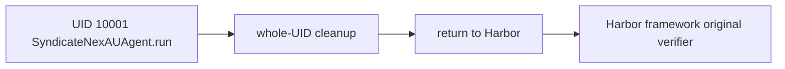

# Harbor lifecycle

P08c runs NexAU only as UID `10001`, probes that `/tests` and `/solution` are
absent before dispatch, then kills and verifies that UID before verifier authority.
The PR11 pipe backend holds shell output only in bounded RAM. NexAU writes no local
trace, shell payload, or final-response file; P10 owns the Neatlogs SDK export.

Depends on P08b and P07b. P09 receives a separate cleanup-gated library API.

## Harbor infrastructure receipt

Pinned `task-a-1` runs established Harbor's framework ordering only: no-op
`task-a-1__5ZMgbAY` rewarded `0` (agent end `07:07:51.787787Z`, verifier start
`07:07:52.005673Z`); oracle-equivalent `task-a-1__kcWP5cF` rewarded `1` (agent
end `07:09:44.944566Z`, verifier start `07:09:45.142066Z`). Both used Harbor's
original verifier without exceptions or a model. The oracle solution upload is
infrastructure evidence, never SyndicateNexAUAgent or Agent A performance.
