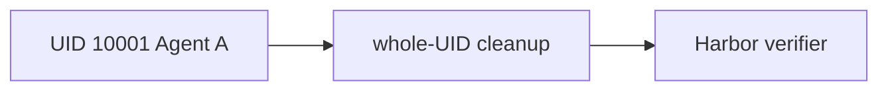

# Harbor lifecycle

P08c runs NexAU only as UID `10001`, probes that `/tests` and `/solution` are
absent before dispatch, then kills and verifies that UID before verifier authority.
The PR11 pipe backend holds shell output only in bounded RAM. NexAU writes no local
trace, shell payload, or final-response file; P10 owns the Neatlogs SDK export.

Depends on P08b and P07b. P09 may inject verifier files only after `complete=true`.
