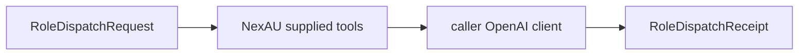

# Role dispatch

`dispatch_role` accepts one strict, fixed-model request and caller-provided NexAU
tools/OpenAI client. It adds no tool and writes no payload artifact. The caller
supplies an OpenAI client configured with `max_retries=0`; NexAU retries once.

Depends on P08b. P10 owns Neatlogs capture; P09 owns trusted verifier receipts.
