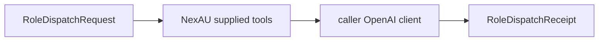

# Role dispatch

`dispatch_role` accepts one strict, fixed-model request and caller-provided NexAU
tools/OpenAI client. It adds no tool and writes no payload artifact. The caller
supplies an OpenAI client configured with `max_retries=0` and the approved model
endpoint; NexAU makes one attempt. URL normalization accepts host casing, default
HTTPS ports and an omitted trailing slash, but rejects a different origin or path.
Tools are shallow-copied to set serial execution without mutating caller settings.

Each dispatch groups wrapped OpenAI calls under a role-specific Neatlogs workflow.
Process startup owns tracing initialization; dispatch never reinitializes the SDK.

Cancellation requests NexAU cleanup but cannot forcibly terminate Python tool
threads. Caller-supplied tools must implement their own bounded I/O and cooperative
cancellation. A timeout is not evidence that tool side effects have stopped; sandbox
cleanup and verifier admission remain the lifecycle owner's responsibility.
