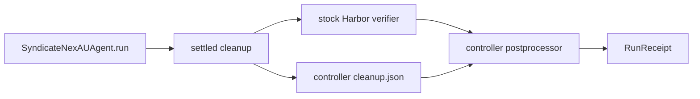

# Stock Harbor receipt bridge

P09c leaves `SingleStepTrial` unchanged. After settled cleanup, the adapter writes
one controller-owned atomic JSON receipt containing only controller IDs, task ID,
UID, completion flag and timestamp. The postprocessor consumes that exact receipt
only after Harbor's original verifier completes; it rejects missing IDs, adapter,
ordering, cleanup proof or verifier result and never invokes a verifier itself.

Publication flushes and syncs a temporary file in the receipt directory, then
links it to `cleanup.json` without replacing an existing receipt. Failed writes
leave no partial public receipt. The temporary name is removed on exit.

The bridge accepts Harbor's concrete `TrialResult`. Agent and verifier intervals
must both be complete, timezone-aware and ordered. The cleanup timestamp must
fall within agent execution, and verification must start after agent execution
finishes. The cleanup object is the sole authority for cleanup status.

Depends on P08e and P09b. The receipt is a control artifact, not a trajectory.

## Native no-model receipts

Two labelled stock `task-a-1` runs used the production adapter import path with
the loopback no-model endpoint. `8d28becc-94ef-4427-994a-928011feb6f8` /
`ea81c4e6-db7b-41dc-a595-b00c36d5f184` / `6eba2509-6595-4883-addb-b6877b5ad028`
settled UID `10001` at `08:12:39.744710Z`; Harbor verifier began
`08:12:39.970119Z`. `bbc4af57-3d40-4073-8530-6ca10ec14b15` /
`4e322f70-8d33-4104-bd34-f798f23e18ec` / `142e0ca2-0c2d-4b9b-8a0c-aedf1466dd52`
settled at `08:13:14.670437Z`; verifier began `08:13:14.876831Z`.

Both stock verifier results were missing, so the postprocessor rejected terminal
receipts. These prove adapter import-path, cleanup and stock-verifier ordering,
not Agent A or model performance.
