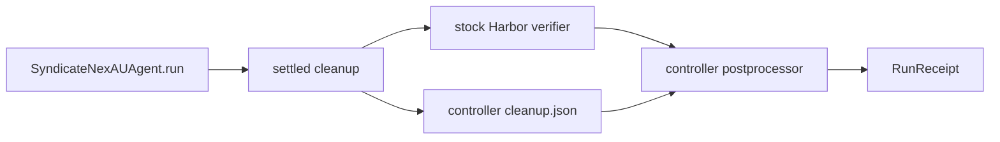

# Stock Harbor receipt bridge

P09c leaves `SingleStepTrial` unchanged. After settled cleanup, the adapter writes
one controller-owned atomic JSON receipt containing only controller IDs, task ID,
UID, completion flag and timestamp. The postprocessor consumes that exact receipt
only after Harbor's original verifier completes; it rejects missing IDs, adapter,
ordering, cleanup proof or verifier result and never invokes a verifier itself.

Depends on P08e and P09b. The receipt is a control artifact, not a trajectory.
