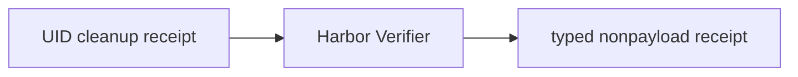

# Trusted verifier receipt

P09 invokes Harbor's original `Verifier` only after P08c confirms whole-UID
cleanup. Only its sole numeric `reward` of `0` or `1` maps to `fail` or `pass`;
missing, malformed, multi-valued, fractional, and exceptional results are
`unverified`. Receipts retain an opaque Harbor result reference, never output.

Depends on P08c / #21. This 136-LOC slice is below the 500-LOC limit.
