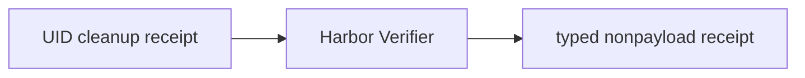

# Trusted verifier receipt

P09 invokes Harbor's original `Verifier` only after P08c confirms whole-UID
cleanup. Only its sole numeric `reward` of `0` or `1` maps to `fail` or `pass`;
missing, malformed, multi-valued, fractional, and exceptional results are
`unverified`. Receipts retain an opaque Harbor result reference, never output.

The serialized cleanup object is the sole cleanup proof. `cleanup_complete` is
a derived, read-only convenience property and is not serialized. Verified
outcomes require complete cleanup and matching verifier reasons and rewards;
unverified or cancelled receipts cannot claim a reward or a passed/failed reason.

Depends on P08c / #21.
