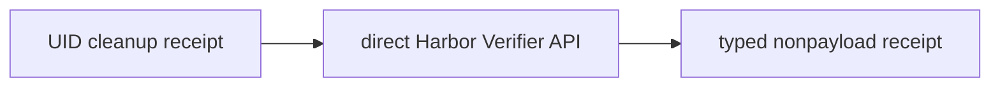

# Trusted verifier receipt

The direct `verify_with_harbor` library API requires a P08c whole-UID cleanup
receipt before it invokes Harbor's original `Verifier`. Only its sole numeric
`reward` of `0` or `1` maps to `fail` or `pass`; all other results are
`unverified`. Native Harbor Trial verification stays framework-owned.

Depends on P08c / #21. The direct API never replaces native Trial verification.
